# dr Łukasz Wawrowski

Adres e-mail: lukasz.wawrowski@ai.lukasiewicz.gov.pl / lukasz.wawrowski@uekat.pl

Strona internetowa: [wawrowski.edu.pl](http://www.wawrowski.edu.pl/)

Aktualne zatrudnienie:

- [Łukasiewicz - AI](https://ai.lukasiewicz.gov.pl/pl/)

Poprzednie:

- [Urząd Statystyczny w Poznaniu](https://poznan.stat.gov.pl/osrodki/osrodek-statystyki-malych-obszarow-1088/)
- [DOJI S.A.](https://doji.com.pl/)
- [Uniwersytet Ekonomiczny w Poznaniu](https://ue.poznan.pl/uniwersytet/instytuty-i-katedry/instytut-informatyki-i-ekonomii-ilosciowej/katedra-statystyki/)
- [QED Software](https://qedsoftware.com/)

---

# Centrum Badawcze Informatyki

- naukowcy i specjaliści IT

- trzy grupy badawcze

- projekty naukowe i komercyjne

- kompetencje: analiza danych, metody AI, projektowanie systemów

---

# Wybrane projekty

[Mine.IO](https://pilotpl.mineio-horizon.eu/) - Opracowanie technologii opartej na sztucznej inteligencji do monitorowania procesu flotacji rud metali we współpracy z Łukasiewicz – ITR, Akademią Górniczo-Hutniczą oraz KGHM Polska Miedź S.A.

CALL-POL (Childhood ALL in Poland) - ułatwienie dostępu do najnowszych terapii dla polskich dzieci cierpiących na ostrą białaczkę: proponowane terapie będą dostępne dla wszystkich dzieci w Polsce, a opcje leczenia będą określane przy użyciu zaawansowanych i najnowocześniejszych narzędzi diagnostyki molekularnej.

[RuleMiner](https://ruleminer.ai/) - System RuleMiner pozwala na analizę i eksplorację odpowiednio przygotowanych danych tabelarycznych opisujących różne obszary działalności człowieka. System nakierowany jest na specyficzny obszar analiz – wynikiem analiz jest zestaw zrozumiałych dla użytkownika reguł, które opisują zależności występujące w danych.

OŚWIATA – Badanie dopasowania efektów kształcenia w polskim systemie oświaty do przyszłych potrzeb rynku pracy.  Przeprowadzenie prac badawczych, podczas których zidentyfikowane zostaną trendy i przedstawione zostaną przewidywania wymagań pracodawców względem przyszłych pracowników, którzy obecnie kształceni się w polskim systemie oświaty, m.in. na poziomie szkół podstawowych, średnich jak i wyższych oraz zmian w zdobywanych kompetencjach zawodowych i przygotowania do zawodów przyszłości. 

---

class: inverse, center, middle

# Cyberbezpieczeństwo

---

# Projekt nr 1

Jest rok 2018 i wspólnie z partnerami rozpoczynamy projekt:

Zwiększenie poziomu cyberbezpieczeństwa w administracji publicznej poprzez opracowanie oraz pilotażowe wdrożenie centrum bezpieczeństwa cyfrowego dedykowanego instytucjom publicznym, z perspektywą objęcia wsparciem także podmiotów spoza sektora publicznego. Kluczowym celem badawczym projektu jest rozszerzenie zakresu źródeł informacji o incydentach sieciowych oraz stworzenie rozwiązań umożliwiających bardziej efektywne identyfikowanie zagrożeń.

- Od czego zaczynamy?
- Gdzie powstanie największa wartość?
- Co jest największym ryzykiem?

---

# RegSOC

**Cel projektu**

Podniesienie poziomu bezpieczeństwa cyfrowego w sektorze publicznym poprzez przygotowanie i prototypowe uruchomienie centrum cyberbezpieczeństwa na użytek podmiotów publicznych, z możliwością rozszerzenia na podmioty niepubliczne. Najważniejszy obszar badawczy projektu to poszerzenie źródeł danych o zdarzeniach zachodzących w sieci i wypracowanie rozwiązań skuteczniej wykrywających zagrożenia.

Konsorcjum:
- Politechnika Wrocławska (Lider), 
- Naukowa i Akademicka Sieć Komputerowa Państwowy Instytut Badawczy (NASK-PIB), 
- Instytut Technik Innowacyjnych EMAG.

1 marca 2018 r. - 28 lutego 2021 r.

---

# RegSOC

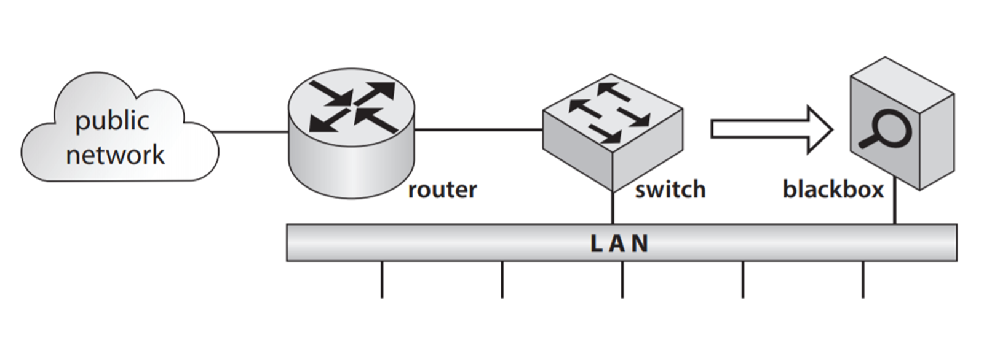

- średniej wielkości przedsiębiorstwo
- Packetbeat i ElasticSearch
- metody klasyfikacji

---

# RegSOC - dane

187 665 600 strumieni danych agregowanych w interwałach jedno-minutowych.

Każdy agregat zawierał 45 zmiennych:
- liczba strumieni komunikacji,
- liczba przychodzących i wychodzących pakietów,
- rozmiar przychodzących i wychodzących pakietów,
- liczba pakietów określonych protokołów (dns, ftp, http, icmp, pgsql, rdp, ssh, tls).

---

# RegSOC - ataki

- dwa hosty w roli atakujących
- dwa hosty w roli ofiar
- ataki przeprowadzane w ciągu 72 godzin

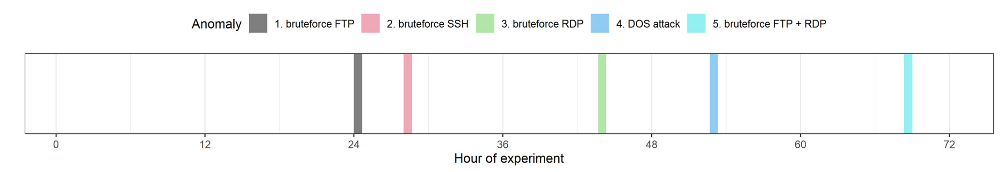

Scenariusz realizowany trzy razy w różne dni i o różnych porach.

---

# RegSOC - walidacja krzyżowa

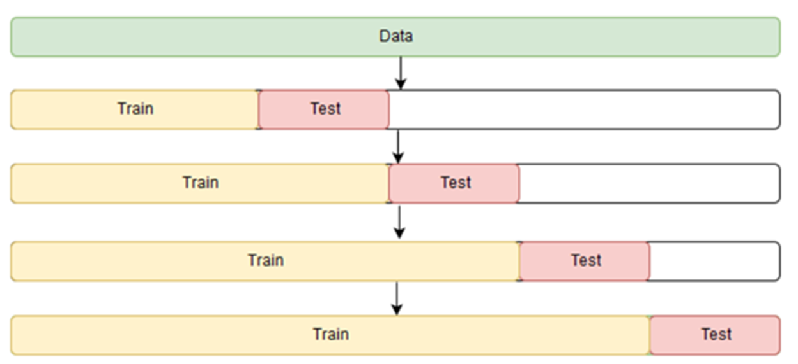

W tym podejściu zbiór testowy obejmował okres 36 godzin.

---

# RegSOC - metody

Metody klasyfikacji:
- Logistic regression (GLM)
- Random forests (RF)
- Neural networks (NN)
- Gradient boosting (GBM)

Metody XAI:
- feature importance
- Shapley values

Do implementacji wykorzystano [język R](https://www.r-project.org/) oraz [pakiet h2o](https://h2o.ai/).

---

# RegSOC - wyniki

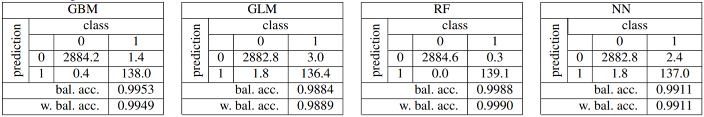

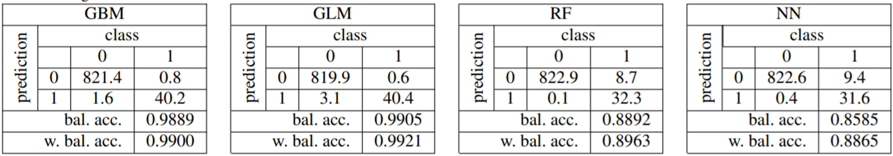

---

# RegSOC - wyjaśnialność

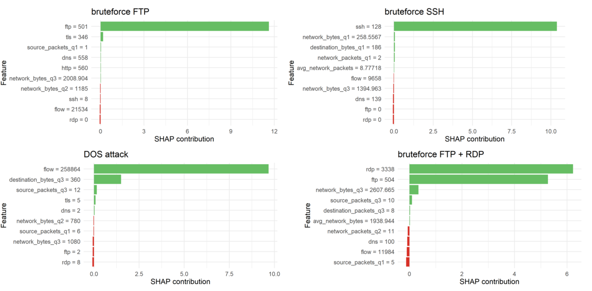

---

# RegSOC - MWA

**Moduł Wykrywania Anomalii**

- biblioteka pythona

- działa w trybie online i offline

- różne formaty zbierania danych 

- metody uczenia nienadzorowanego: RKOF i VAE

- wiele parametrów uczenia: wielkość okna analizy, liczba sąsiadów

---

# RegSOC - architektura

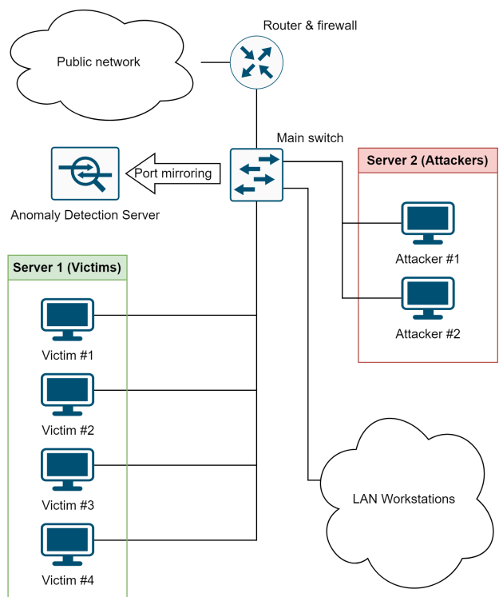

---

# RegSOC - ataki

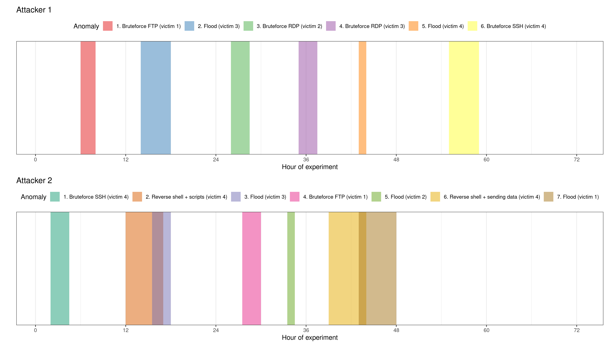

---

# RegSOC - wyniki

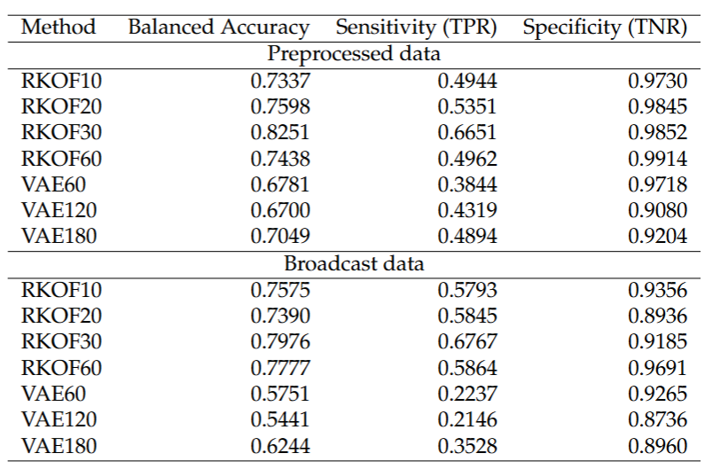

---

# RegSOC - połączenie metod

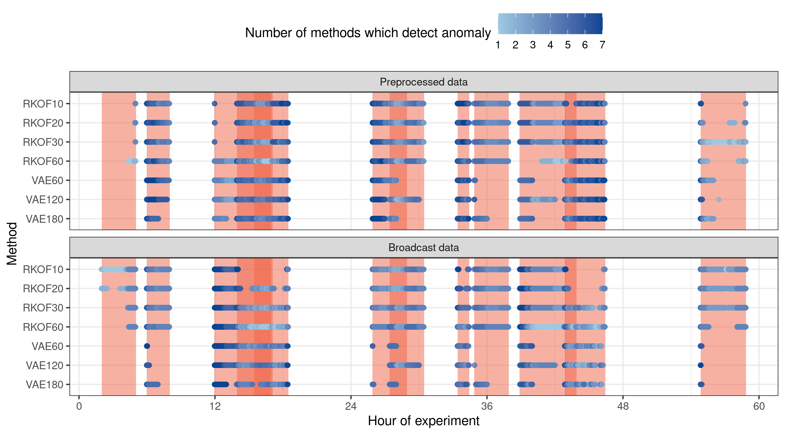

---

# RegSOC - podsumowanie

[Wawrowski Ł., Michalak M., Białas A., Kurianowicz R., Sikora M., Uchroński M., Kajzer A.: Detecting Anomalies and Attacks in Network Traffic Monitoring with Classification Methods and XAI-based Explainability, Procedia Computer Science, 192:2259-2268, 2021](https://www.sciencedirect.com/science/article/pii/S1877050921017361)

[Zbiór danych](https://www.kaggle.com/datasets/wawrluk/regsoc-kes2021)

[Wawrowski Ł, Białas A, Kajzer A, Kozłowski A, Kurianowicz R, Sikora M, Szymańska-Kwiecień A, Uchroński M, Białczak M, Olejnik M, Michalak M., 2023, Anomaly Detection Module for Network Traffic Monitoring in Public Institutions, Sensors, 23(6):2974. https://doi.org/10.3390/s23062974](https://www.mdpi.com/1424-8220/23/6/2974)

[Zbiór danych](https://www.kaggle.com/datasets/wawrluk/regsoc-sensors2023)

---

# Projekt nr 2

Jest rok 2021 i wspólnie z partnerami rozpoczynamy projekt:

Opracowanie rozwiązania przeznaczonego do ochrony użytkowników, systemów oraz urządzeń internetu rzeczy z wykorzystaniem metod uczenia maszynowego i analizy zachowań. Projekt zakłada stworzenie systemu umożliwiającego stały nadzór nad bezpieczeństwem różnorodnych urządzeń IoT. Architektura rozwiązania obejmuje centralny moduł SOC (Security Operations Center) funkcjonujący w modelu SaaS oraz dedykowane oprogramowanie monitorujące dla urządzeń IoT, tzw. Agent. Agent odpowiada za gromadzenie i agregowanie danych oraz ich przekazywanie do SOC, gdzie prowadzone są analizy bezpieczeństwa z zastosowaniem algorytmów uczenia maszynowego.

- co będzie najtrudniejsze przy wdrożeniu tego w praktyce?
- gdzie może „wysypać się” taki system? (technicznie / organizacyjnie)
- czy klienci będą chcieli z tego korzystać — i dlaczego (lub nie)?

---

# SPINET

**Cel projektu**

Budowa narzędzia dedykowanego dla ochrony użytkowników, systemów i urządzeń internetu rzeczy, w oparciu o uczenie maszynowe i analizę behawioralną. Celem projektu jest stworzenie systemu służącego ciągłemu monitorowaniu bezpieczeństwa w szerokim zakresie urządzeń IoT. Rozwiązanie obejmuje część centralną SOC (ang. Security Operations Center) działającą w modelu SaaS oraz dedykowane dla urządzeń IoT oprogramowanie monitorujące (Agent). Zadaniem Agenta jest zbieranie i agregowanie danych oraz wysyłanie ich do SOC, gdzie przeprowadzane są analizy bezpieczeństwa z wykorzystaniem algorytmów uczenia maszynowego.

Konsorcjum:
- Instytut Technik Innowacyjnych EMAG (lider),
- Efigo Sp. z o.o.
- QED Software

1 lipca 2021 r. - 30 czerwca 2024 r.

---

# SPINET - rezultaty

- Agent (oprogramowanie typu klient) monitorujące zagrożenia w trybie ciągłym w punkcie końcowym sieci komputerowej - urządzenie typu SBC pracujące na Linux.​

- Serwer wyposażony w algorytmy analizy behawioralnej oraz uczenia maszynowego stanowiący centralny punkt dystrybucji informacji o zagrożeniach.​

- Aplikacja typu SOC służąca do zarządzania urządzeniami i wykrytymi zagrożeniami.

---

# SPINET - dane

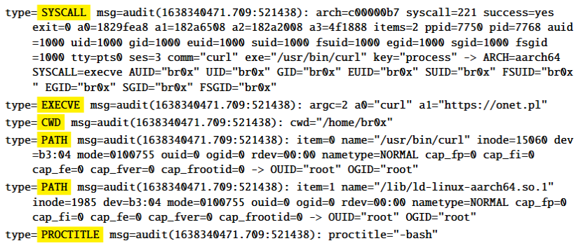

Wykorzystano `auditd` do zbierania logów i `fluentd` do ich przesyłania.

---

# SPINET - pierwsze modele

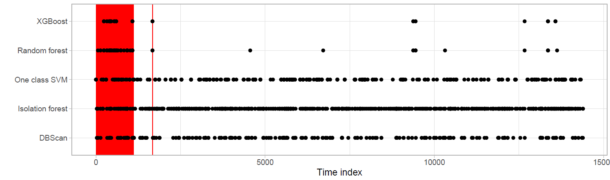

---

# SPINET - wymiarowość danych

Pierwotny zbiór danych zawierał 42 kolumny 74 272 772 obserwacji.

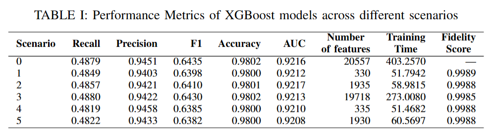

---

# SPINET - połączenie metod

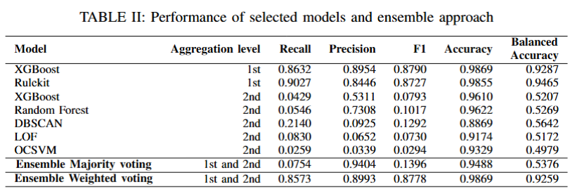

---

# SPINET - architektura systemu

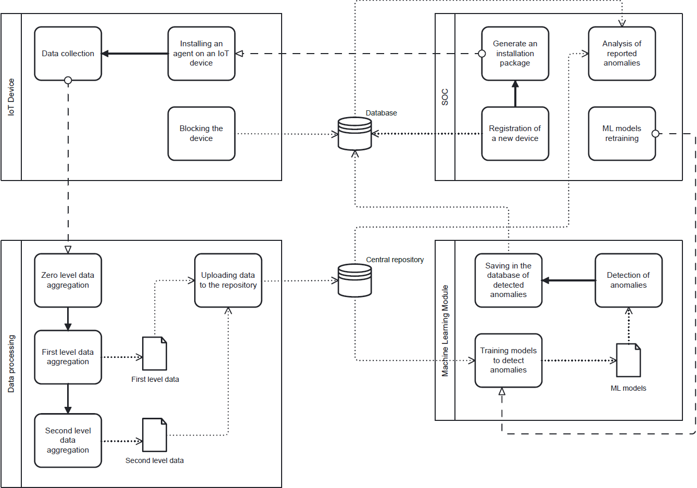

---

# SPINET - [aplikacja](https://app.spinet.tech/?lang=pl)

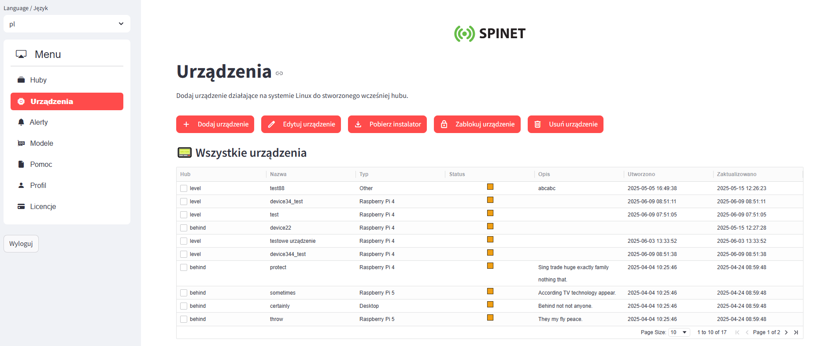

---

# SPINET - podsumowanie

[spinet.tech](https://spinet.tech/)

[Wawrowski, Ł., Chwełatiuk, K., Michalak, M., Kostorz, I., Ślȩzak, D., Biczyk, P., Adamczyk, B., Brzȩczek, M. 2025, Information Granulation for Hierarchical Feature Selection in Detection of Anomalies in IoT Devices. In 2025 IEEE International Conference on Big Data (BigData) (pp. 4207-4216). IEEE.](https://ieeexplore.ieee.org/document/11401486/)

[FedCSIS 2023 Challenge: Cybersecurity Threat Detection in the Behavior of IoT Devices](https://knowledgepit.ml/fedcsis-2023-challenge/)

[Michalak, M., Biczyk, P., Adamczyk, B., Brzęczek, M., Hermansa, M., Kostorz, I., Wawrowski, Ł., Czerwiński, M. 2023, A New Data Model for Behavioral Based Anomaly Detection in IoT Device Monitoring. In International Joint Conference on Rough Sets, pp. 599-611. Cham: Springer Nature Switzerland.](https://link.springer.com/chapter/10.1007/978-3-031-50959-9_41)

[Adamczyk, B., Brzȩczek, M., Michalak, M., Kostorz, I., Wawrowski, Ł., Hermansa, M., Czerwiński, M., Jamiołkowski, A., 2022, Dataset Generation Framework for Evaluation of IoT Linux Host–Based Intrusion Detection Systems, 2022 IEEE International Conference on Big Data, 6179-6187, DOI: 10.1109/BigData55660.2022.10020442](https://ieeexplore.ieee.org/abstract/document/10020442/)

---

# Projekt nr 3

Jest rok 2025 i wspólnie z partnerami rozpoczynamy projekt:

Projekt koncentruje się na wykorzystaniu sztucznej inteligencji do identyfikacji i analizy zagrożeń w cyberprzestrzeni na potrzeby Centrów Operacji Bezpieczeństwa (SOC) oraz krajowych struktur cyberbezpieczeństwa. Jego celem jest zwiększenie efektywności wykorzystania zasobów bezpieczeństwa cyfrowego, a także podniesienie poziomu zaawansowania procesów realizowanych w obszarze SOC i cyberwywiadu o zagrożeniach (CTI) dzięki wdrożeniu technologii opartych na AI. Realizacja przedsięwzięcia wspiera rozwój zastosowań sztucznej inteligencji w krajowych centrach bezpieczeństwa, wzmacnia ochronę infrastruktury krytycznej oraz przyczynia się do budowy bardziej odpornego systemu bezpieczeństwa państwa.

- Jakie metody AI możemy wykorzystać?
- Których decyzji nie powinniśmy oddawać AI?
- Jakie nowe ryzyka wprowadza AI do cyberbezpieczeństwa?

---

# CTI-AI

**Cel projektu**

Rozpoznawanie zagrożeń cyberprzestrzeni oparte na sztucznej inteligencji dla Centrów Operacji Bezpieczeństwa i Narodowego Cyberbezpieczeństwa. Projekt zoptymalizuje skalowalność zasobów cyberbezpieczeństwa i zwiększy dojrzałość operacji SOC (Security Operations Center) i analizy zagrożeń (CTI) dzięki technologiom opartym na sztucznej inteligencji. Inicjatywa ta przyczynia się do wykorzystania sztucznej inteligencji w krajowych centrach SOC, ochrony infrastruktury krytycznej i wzmocnienia krajowych ram bezpieczeństwa.

Konsorcjum:
- Łukasiewicz - AI (lider)
- EclecticIQ
- NRD Cyber Security

1 stycznia 2025 r. - 31 grudnia 2027 r.

---

# CTI-AI 

.pull-left[

Cyber Threat Intelligence (CTI) to proces pozyskiwania, analizy i wykorzystania informacji o zagrożeniach cybernetycznych w celu  lepszego podejmowania decyzji w obszarze bezpieczeństwa.

Źródła danych dla CTI:

- Źródła otwarte i komercyjne
- Organizacja
- Społeczności
- Dark i deep web

]

.pull-right[

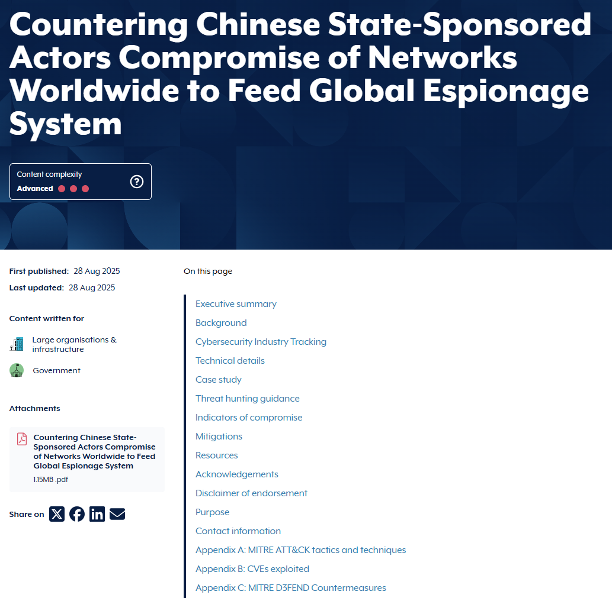

]

---

# CTI-AI - zadania

1. Automatyczna klasyfikacja tekstu raportu do taksonomii MITRE ATT&CK: analiza raportów CTI oraz zastosowanie klasyfikacji wieloetykietowej umożliwiającej przypisanie odpowiednich etykiet do opisanych incydentów.

2. Automatyczne mapowanie relacji: opracowanie metody umożliwiającej ekstrakcję nazw relacji na podstawie kontekstu semantycznego występującego w treści raportów zgodnie ze standardem STIX 2.1.

3. Automatyczne podsumowania z systemem rekomendacji

4. Model predykcyjny prawdopodobieństwa ataku

5. Semantyczne przeszukiwanie bazy raportów

6. Automatyczne generowanie reguł detekcyjnych

---

# CTI-AI - MITRE ATT&CK

.pull-left[

MITRE ATT&CK (Adversarial Tactics, Techniques, and Common Knowledge) to globalna baza wiedzy o taktykach i technikach przeciwdziałania opartych na rzeczywistych cyberatakach.

Pomaga organizacjom zrozumieć, wykrywać i bronić się przed cyberzagrożeniami poprzez mapowanie zaobserwowanych przeciwnych zachowań na znane techniki.

211 technik i 468 podtechnik w ramach 14 taktyk

]

.pull-right[

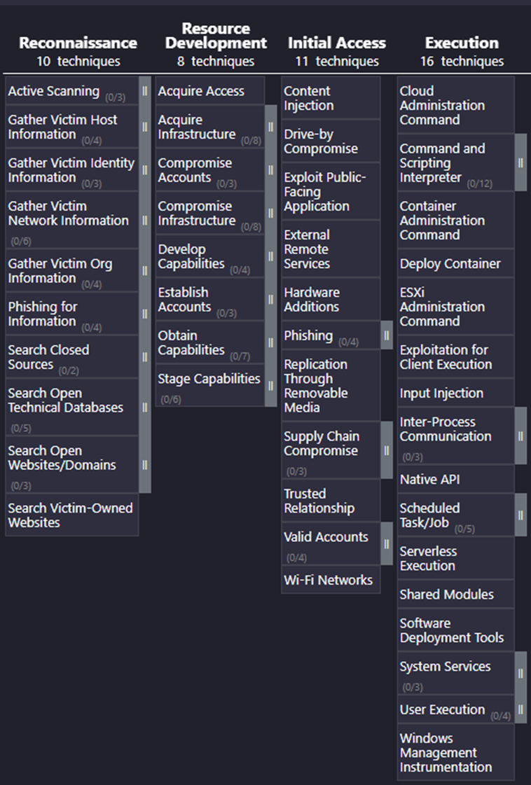

]

---

# CTI-AI - dane

|     Zbiór      |     Link                                                             |     Aktualizacja    |     Raporty    |     Zdania    |     Pokrycie technik    |
|----------------|----------------------------------------------------------------------|---------------------|----------------|---------------|-------------------------|
|     TRAM       |     https://github.com/center-for-threat-informed-defense/tram       |     27.08.2023      |     300        |     5089      |     23,7%               |
|     AnnoCTR    |     https://github.com/boschresearch/anno-ctr-lrec-coling-2024       |     11.04.2024      |     120        |     7416      |     62,5%               |
|     CISA       |     https://www.cisa.gov/                                            |     30.09.2025      |     121        |     1398      |     86,5%               |
|     ASD        |     https://www.cyber.gov.au                                         |     30.09.2025      |     22         |     282       |     69,1%               |

---

# CTI-AI - metody

.pull-left[

Modele wykorzystujące architekturę transformera:

- DistilBERT: popularny lekki model.
- SciBERT: model BERT wytrenowany na tekstach naukowych.
- DeBERTaV3:  ulepszony model od MS.
- SecureBERT: model BERT wytrenowany na tekstach cybersec.

]

.pull-right[

Analiza podobieństwa tekstu raportów do definicji z macierzy MITRE ATT&CK.

Modele embeddingowe:
- nomic-embed-text
- mxbai-embed-large
- ibm-research/CTI-BERT
- basel/ATTACK-BERT
- openai/text-embedding-3-large

]

---

# CTI-AI - wyniki

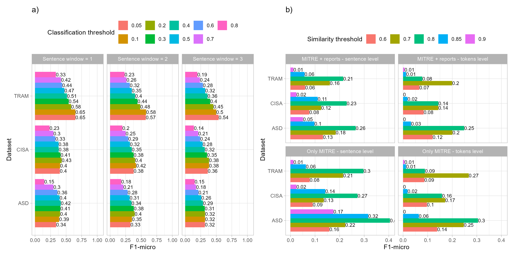

---

# CTI-AI - wyniki

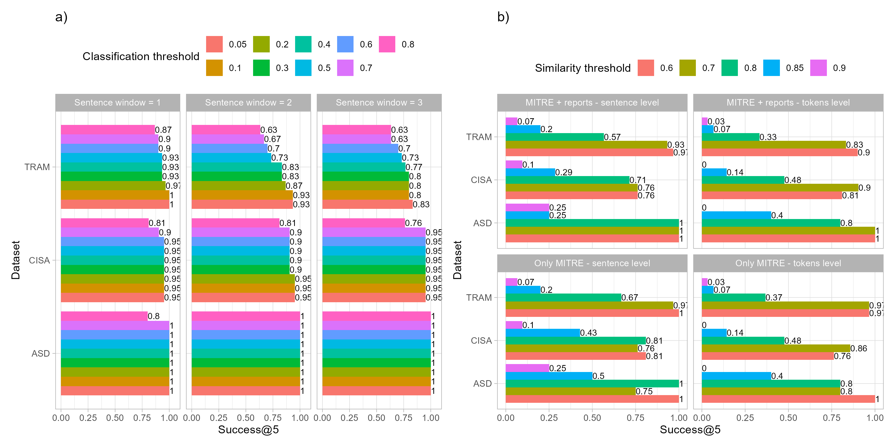

---

# CTI-AI - STIX

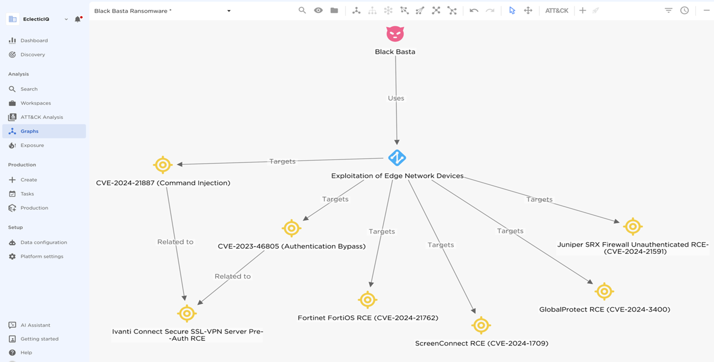

---

# CTI-AI - STIX

.pull-left[

Wieloetapowy proces: 

1. Identyfikacja encji
2. Klasyfikacja encji
3. Detekcja relacji
4. Klasyfikacja typu relacji

Fine-tuned LLM

Single-stage

]

.pull-right[

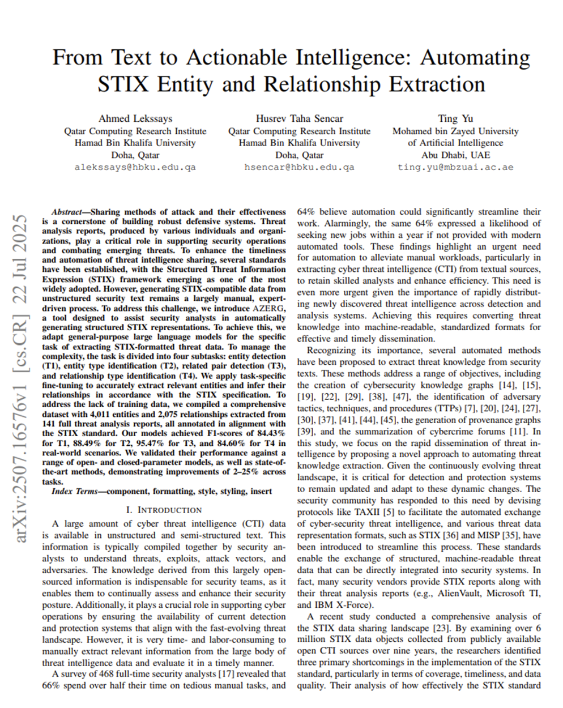

]

---

# CTI-AI - wyniki

| approach     | model config                        | precision | recall |     f1 | accuracy |
|--------------|-------------------------------------|----------:|-------:|-------:|---------:|
| single-stage | gpt-5.1\_reasoning-effort-medium    |    0.5140 | 0.5959 | 0.5232 |   0.8291 |
| single-stage | gpt-5.1\_reasoning-effort-low       |    0.5245 | 0.5797 | 0.5211 |   0.8280 |
| single-stage | gpt-5-mini\_reasoning-effort-medium |    0.4704 | 0.6377 | 0.4981 |   0.7918 |
| multi-stage  | gpt-5-mini\_reasoning-effort-low    |    0.4117 | 0.6833 | 0.4603 |   0.7261 |
| multi-stage  | gpt-4.1-mini\_temperature-0.7       |    0.5123 | 0.4977 | 0.4597 |   0.7595 |
| multi-stage  | azerg-default                       |    0.2796 | 0.4012 | 0.3032 |   0.6780 |

---

# CTI-AI - podsumowanie

Testy kolejnych architektur i trenowanie dedykowanych modeli poprawiających jakość klasyfikacji i ekstrakcji.

Udostępnianie wyników, danych i narzędzi, aby rozwijać ekosystem CTI-AI i wspierać społeczność.

[cti-ai.eu](https://cti-ai.eu/)

---

class: inverse, center, middle

# Pytania?
